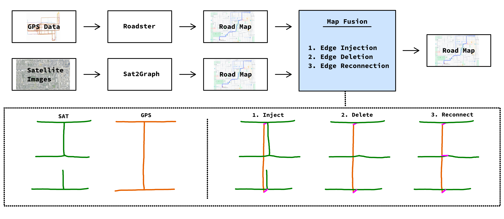

# Map-Fusion: Multi-Modal Road Network Reconstruction

A late-fusion algorithm for improving road network reconstruction by combining GPS trajectory data with satellite imagery. This project resolves road continuation conflicts between GPS-based and satellite-based reconstructions through geometric algorithms.

<p align="center">
  
  <br>
  <em>The full late-fusion map reconstruction pipeline, highlighting the novel map fusion algorithm step contributed by this research project</em>
</p>

This repo contains both the map fusion algorithm procedure as well as the entire pipeline, including the experiments and the generation of diagrams and visualizations as seen in the thesis

The master thesis document is found here: [Master Thesis Document](documentation/Master%20Thesis%20Jeroen%20van%20Tubergen%20with%20Appendix.pdf).

It contains in-depth information on the motivation and implementation of the map fusion algorithm, as well as about the various components of the entire late-fusion process, described in the chapters of method and experimental setup respectively.

**Note**: The appendix was added after graduation and is not part of the thesis itself. It was after the thesis got completed that I had the insight of selective injection (using a bidirectional edge coverage check) as a fix to address road continuation better, and the results are promising.

## Running code

I ran the code with [hatch](https://hatch.pypa.io/latest/). 
1. Install hatch
2. Enter the virtual environment that automatically installs dependencies with `hatch shell`
3. Run python code, such as `python src/main.py`


### Data Requirements

In order to retrieve satellite images you require a Google API key that allows downloading satellite images.
For the multimodal dataset you need less than 1GB, but the generation of experiment artefacts I had to generate over 50GB of precomputed shortest path data for the APLS metric.
- Google API key in `~/.cache/gmaps-image/api_key.txt` for satellite data
- Sufficient storage for Berlin (~500MB) and Chicago (~77MB) datasets
- Sufficient storage for experiment artifacts (~50GB)


## Repository Structure

```
map-fusion/
├── src/                # Code implementation
│   ├── data/             # Data acquisition and preprocessing
│   ├── graph/            # Graph operations and fusion algorithms
│   ├── map_similarity/   # APLS and TOPO metric implementations
│   └── experiments.py    # Experiment definitions and analysis
├── data/               # Processed datasets and results
│   ├── graphs/           # Generated graph files (.graphml, .graph)
│   ├── experiments/      # Cached experiment results
│   └── pickled/          # Serialized intermediate data
├── documentation/      # Detailed pipeline documentation
└── images/               # Visualization outputs and qualitative results
```

## Citation

In case you use parts of this work, please cite accordingly:

```bibtex
@mastersthesis{late-mapfusion2025,
  title={Geometric Late-Fusion of GPS and Satellite-based Road Network Reconstructions},
  author={Jeroen van Tubergen},
  school={Utrecht University},
  year={2025},
  note={Available at: https://github.com/jvtubergen/map-fusion}
}
```

Cite other dependencies if applicable.
The following request for citation that I am aware of:
* [Mapconstruction](http://mapconstruction.org)
* [OSMnx](https://github.com/gboeing/osmnx)
* [Seaborn](https://doi.org/10.21105/joss.03021)
* [Matplotlib](https://matplotlib.org)
* [Roadster](https://github.com/Erfanh1995/Roadster)
* [Sat2Graph](https://github.com/songtaohe/Sat2Graph)

For the frechet implementation information is provided in the repo at [partial-curve-matching-rs](https://github.com/jvtubergen/partial-curve-matching-rs) under [Acknowledgements](https://github.com/jvtubergen/partial-curve-matching-rs?tab=readme-ov-file#acknowledgement).